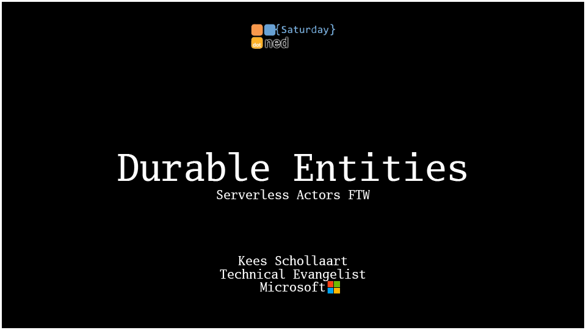

# Serverless Actors With Durable Entities

Code and slides for this session, given at DotNedSaturday.nl

3 demo's in 3 branches:
- [Demo 1, Plain Durable Functions](https://github.com/keesschollaart81/Serverless-Actors-With-Durable-Entities/tree/step-1-orchestration)
- [Demo 2, Simple Entity](https://github.com/keesschollaart81/Serverless-Actors-With-Durable-Entities/tree/step-2-entity)
- [Demo 3, Entity and Orchestrator](https://github.com/keesschollaart81/Serverless-Actors-With-Durable-Entities/tree/step-3-entity-with-orchestration)

[Click here for slides
](https://1drv.ms/p/s!AvX-n0DZ_wi2kKh5qykSeVtSlmYdFQ?e=96HMlo)